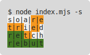
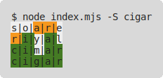

# wordle-solver

A solver for Wordle, written in NodeJS using modules and classes and other fancy stuff.

## How to use it

### Setup

#### Linux / OS-X:

* Clone the repo or download the sources as a zip file:
    * `git clone https://github.com/Fordi/wordle-solver.git; cd wordle-solver`
    * or
    ```
    wget https://github.com/Fordi/wordle-solver/archive/refs/heads/main.zip
    unzip main.zip -d wordle-solver
    rm main.zip
    ```
* [Install NVM](https://github.com/nvm-sh/nvm#install--update-script)
* Run `nvm install`
* Run `npm ci`

#### Windows

* Install [NVS](https://github.com/jasongin/nvs/releases)
* Install [Git](https://git-scm.com/download/win)
* Clone the repo:
    * `git clone https://github.com/Fordi/wordle-solver.git; cd wordle-solver`
* Run `npm ci`

If you plan on using the twitter functions (seriously, why?), set up the `twitter.json` file.

### Usage

```
Usage: node index.mjs ...

    -s|--solveToday  Solve today's puzzle
    -p|--partial ... Find the next 10 word candidates given a history, e.g., -p weary--?-- pills+?--- vague-+---
    -S|--solve arg   Solve an arbitrary puzzle, e.g., -S cigar
    -r|--reverse ... Solve in reverse, starting with a word and a list of statuses, e.g., -r cigar ???-- +?--+ ++-++ +++++
    -d|--dryRun      Do everything, but don't send the tweet
    -t|--tweet       Solve today's puzzle and tweet about it
    -e|--tweetEod    Tweet wordle-solver's EOD message
    -l|--logStats    Log statistics from twitter
    -D|--dayNum      Report the day number
```

#### -s|--solveToday

Solve today's puzzle (spoiler output), e.g.,



#### -p|--partial ...

Find the next 10 word candidates given a history, e.g.,

```
node index.mjs -p weary--?-+ pills+?--- vague-+---
patin panic paint panim panni campi patio capiz qapik happi
```

Partial states represent a guess and its results, e.g., `weary--?-+` means:

* You tried "weary"
* The "a" is present but misplaced
* The "y" is right where it needs to be
* "w", "e" and "r" are absent


#### -S|--solve arg

Solve an arbitrary puzzle (spoiler output), e.g.,



#### -r|--reverse ...

Solve in reverse, starting with a known solution and a list of statuses, e.g.,
```
node index.mjs -r cigar ???-- +?--+ ++-++ +++++
```

#### -d|--dryRun

For use with `--tweet` and `--tweetEod`.  Do everything, but don't send the tweet.  It's assumed if `twitter.json` is not set up.

#### -t|--tweet

Solve today's puzzle and tweet about it (share-safe output), e.g.,

```
node index.mjs -d -t
wordle-solver 1 4/6
⬛⬛⬛🟨🟨
🟨🟨⬛🟨⬛
🟩🟩🟨⬛⬛
🟩🟩🟩🟩🟩
(wordle-wolver is a DIY Wordle solver I wrote in NodeJS. If you beat the bot,
you're doing great!)
```

#### -e|--tweetEod

Tweet wordle-solvers's EOD message (requires twitter API config), e.g.,

```
node index.mjs -d -e
Stats for 12599 tweets for Wordle 229:
３５⬛⬛⬛🟨🟩🟨⬛
２０⬛⬛⬛🟩🟩🟩⬛
１１⬛⬛⬛🟩🟩🟩🟨
￣６⬛⬛⬛🟩🟩🟩🟩
￣４⬛🟨🟨🟩🟩🟩🟩
￣２⬛🟩🟩🟩🟩🟩🟩
￣％1️⃣2️⃣3️⃣4️⃣5️⃣6️⃣🟥
wordle-solver solved it in 6
If you beat the bot, you're doing great!
```

Until Twitter is configured, `--dryRun` is assumed for `--tweet`, and `--tweetEod` won't work.

Please be aware that `--solveToday` and `--solve` will output the bot's full solution, not just the share-safe version.

#### -l|--logStats

Search for `Wordle ${day} 🟩` on twitter, and add a hash of each tweet ID (for deduplication) and its win count in `./stats/${day}.json`.

#### -d|--dayNum

Print the day number.  On Feb 1, the day number was coming up wrong, and I needed a way to check what wordle-solver thought the day was.

## How it works

In this repository, there's a `freq_map.json` that contains every word that Wordle considers valid, and assigns a frequency to them (based on Wolfram Alpha's WordFrequencyData).  Most of these are not solutions.

The bot is, at the highest level, a bare-bones clone of the game, and a solver for that game.

The game is simple - it knows the answer and, if you guess, it will tell you how wrong you are.  Just like the real thing.

The solver reads the full word list, and makes a frequency table of the letters. It then sorts its word list by the words' "scores" - which are just a sum of the frequency of each letter.  The first item in the list is then the "best" guess.

After each guess, the solver filters the word list, rebuilds the frequency table and re-sorts what's left.

There's also `wordleWords.bin`, which is an obfuscated representation of solutions for days 0 - 2,314 (they're on the game page too - at least as well hidden as I've got 'em).  This allows the solver to solve for the day without actually visiting the site (it also allows me to make changes to the algorithm and find how fast / successful the solver is likely to be, and to run reports on guess count frequency, etc).

## Twitter?

You'll need your Twitter API keys to use the tweet features of this bot.

1. Copy `twitter.template.json` to `twitter.json`
2. Go to https://developer.twitter.com/en/portal/projects-and-apps, and click (+ Create App).
3. Name your app, then grab the `apiKey` and `apiSecret`; put these in `twitter.json`
4. In the sidebar, click on your new app's name, then on the "Keys and tokens" tab.
5. (Revoke) the Bearer Token; you won't be needing one.
5. Under "Access Token and Secret", generate the `accessToken` and `accessTokenSecret`, and put those into `twitter.json`.

## How'd you encode the solutions list?

Not telling.  If you're smart, you can parse through `lib/getTodaysPuzzle.mjs` and work it out.  If you're the author of Wordle and want to use something like this to hide the words, let me know and I'll share source.

## What's this about profiling?

You'll note there's an exclusion for `private/` in `.gitignore`.  That prevents me from committing the wordle solutions list and the scripts I run for doing stuff with it, and for profiling the bot.

No, you can't have those.

## Hey!  I ran it for day X, and it output something different than what it tweeted!

Yeah.  I've been futzing with it since the first tweet.  What about it?
